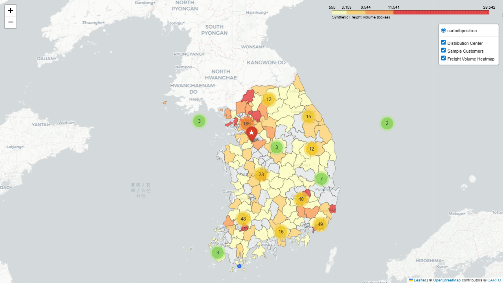

# Freight Volume Dashboard

인턴십 기간에 Oracle DB 기반 물동량 데이터를 조회하고, 거래처 위치와 지역별 출고량을 Folium 지도 위에 시각화했던 프로젝트입니다.

당시에는 사내 Oracle DB와 실제 물류 데이터를 사용했기 때문에, 이 저장소에는 원본 업무 코드를 최대한 보존하되 공개 가능한 샘플 데이터와 보조 실행 스크립트만 함께 정리했습니다.

## Project Overview

이 프로젝트의 목적은 거래처별 출고 물량을 지역 단위로 집계한 뒤, 물류센터와 거래처 위치를 지도에서 확인할 수 있도록 만드는 것이었습니다.

주요 흐름은 다음과 같습니다.

1. Oracle DB에서 거래처 마스터와 출고 데이터를 조회
2. 거래처 주소를 기준으로 위도, 경도, 시군구 정보 생성
3. 시군구별 물동량 합계 계산
4. GeoJSON 행정구역 데이터와 결합
5. Folium으로 거래처 마커와 지역별 Choropleth 지도 생성

## Original Workflow

원본 코드는 Oracle DB에 접속해 `KYO_CU_MST`, `KYO_OUT` 테이블을 조회하는 방식으로 작성되었습니다.

```sql
SELECT CU_NM, CU_ADD, SUM(BOX_TOT)
FROM KYO_CU_MST, KYO_OUT
WHERE STO_NM = CU_NM
GROUP BY CU_NM, CU_ADD;
```

조회한 데이터는 Python `pandas` 데이터프레임으로 변환한 뒤, Google Maps Geocoding API와 시군구 중심좌표 데이터를 활용해 지도 시각화용 데이터로 가공했습니다.

## Main Files

```text
.
├── 히트맵(지오코딩).py          # Oracle 조회, 지오코딩, 물동량 지도 생성 원본 코드
├── 히트맵(지오코딩).ipynb       # 원본 작업 노트북
├── geojson 지도 생성.ipynb      # 행정구역 GeoJSON 지도 작업 노트북
├── state_geo.geojson            # 시군구 경계 GeoJSON
├── 시군구(중심좌표).xlsx         # 시군구 중심좌표 데이터
├── sql/                         # 공개용 Oracle 스키마/쿼리 정리
├── data/                        # 공개용 샘플 데이터
└── scripts/                     # 샘플 데이터 생성 및 데모 지도 생성 보조 스크립트
```

## Tech Stack

- Python
- Oracle DB
- `cx_Oracle`
- `pandas`
- `folium`
- `geopy`
- Google Maps Geocoding API
- GeoJSON

## Public Sample Data

실제 업무 데이터는 공개할 수 없기 때문에, 포트폴리오 확인용으로 동일한 구조의 synthetic data를 추가했습니다.

- `data/raw/kyo_cu_mst_sample.csv`: 거래처 마스터 샘플
- `data/raw/kyo_out_sample.csv`: 출고 이력 샘플
- `data/processed/geo_box_sample.csv`: 지도 시각화용 가공 샘플

샘플 데이터는 실제 고객명, 주소, 물동량을 포함하지 않습니다.

## Preview




## Notes

- 원본 업무 코드는 최대한 수정하지 않고 보존했습니다.
- 공개용 샘플 데이터는 실제 회사/고객/물동량 데이터가 아닙니다.
- 보조 스크립트는 원본 코드의 업무 흐름을 로컬에서 확인하기 위한 재현용 자료입니다.
